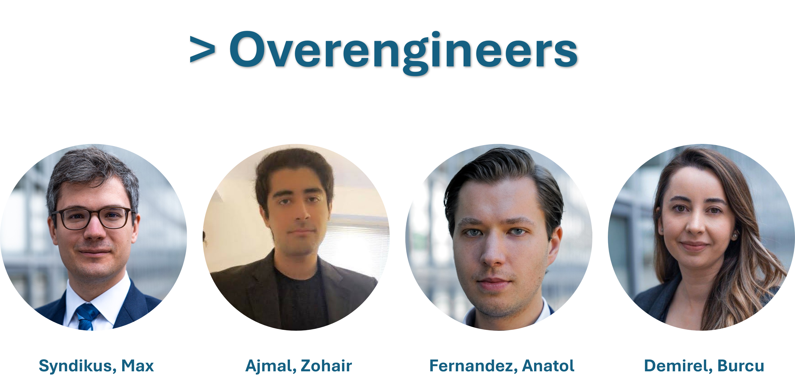
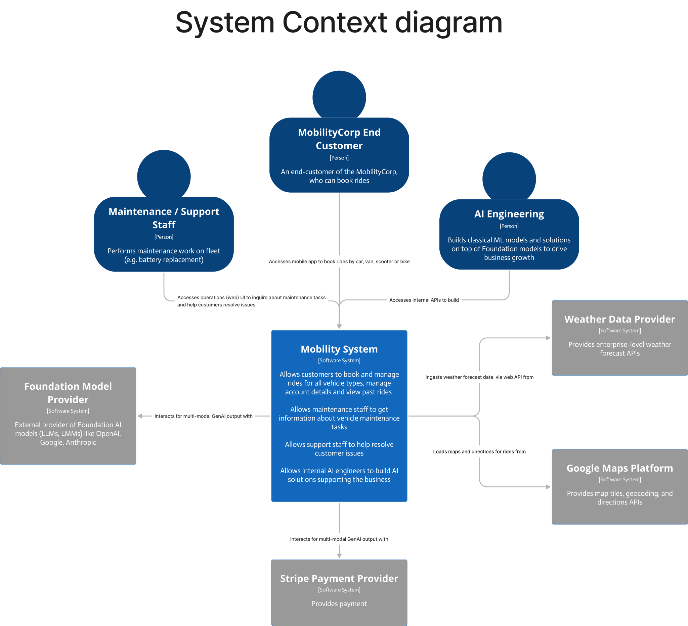
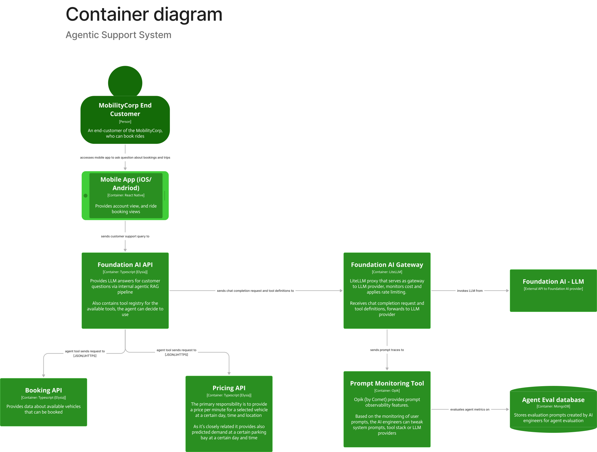
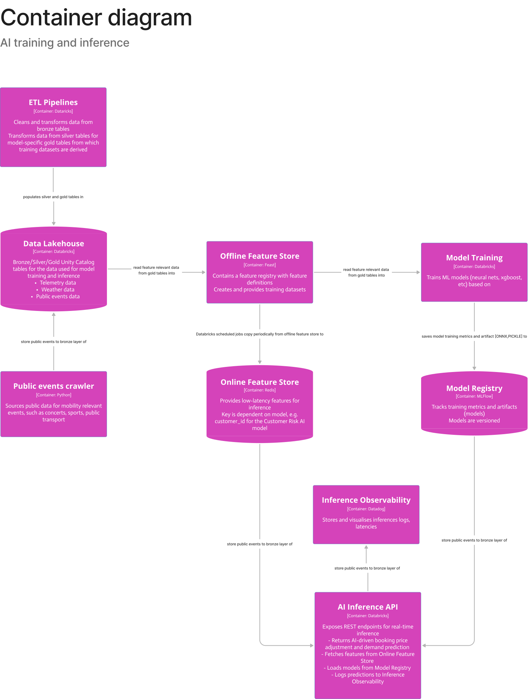

# O'Reilly Architecture Kata Q4 2025: Overengineered Mobility App

## Team
- [Ajmal, Zohair](https://www.linkedin.com/in/zohairajmal/)
- [Demirel, Burcu](https://www.linkedin.com/in/burcu-demirel/)
- [Fernandez, Anatol](https://www.linkedin.com/in/anatol-fernandez/)
- [Syndikus, Max](https://www.linkedin.com/in/max-syndikus-58913a114/)

## Business Model
We are building a solution for a mobility company that owns a fleet of cars, vans, scooters, and bicycles. All vehicles already have premanufactured and provisioned hardware. This business struggles with vehicle availability. Therefore, the goal of this application is to improve on already existing physical assets, while at the same time dealing with the main issues: provide a trustworthy and stable software for customers to reliably find the best fitting transportation options.

The core business features, therefore, are:
- smooth user experience
- reliable infrastructure
- optimized vehicle availability

### Functional Requirements

The list of functional requirements for this project can be found [here](01-functional-requirements/func-reqs.md).

## Architecture Decisions

### General System Design

- [ADR-01: Customer Facing Application](02-adrs/01_CustomerFacingApplication.md)
- [ADR-02: Third-Party Services](02-adrs/02_ThirdPartyServices.md)
- [ADR-03: Legacy Hardware](02-adrs/03_LegacyHardware.md)
- [ADR-04: Backend Services](02-adrs/04_BackendServices.md)
- [ADR-05: Authentication](02-adrs/05_Authentication.md)
- [ADR-06: Database Selection](02-adrs/06_Database.md)
- [ADR-07: Telemetry Streaming](02-adrs/07_TelemetryStreaming.md)
- [ADR-08: Booking Consistency](02-adrs/08_BookingConsistency.md)

### AI/ML Subsystem

- [ADR-09: Separate Offline Online Feature Store](02-adrs/09_SeparateOfflineOnlineFeatureStores.md)
- [ADR-10: Data Collection](02-adrs/10_DataCollection.md)
- [ADR-11: Precompute Demand Surge Grid](02-adrs/11_PrecomputeDemandSurgeGrid.md)
- [ADR-12: Two-Tier Caching CRAI model](02-adrs/12_TwoTierCachingCRAI.md)
- [ADR-13: MLFlow Model Registry](02-adrs/13_MlflowModelRegistry.md)
- [ADR-14: Datadog Observability](02-adrs/14_DatadogObservability.md)

## Architecture Diagram

## C4 Architecture

You can find our C4 architecture diagram also on the [Figma Community](https://www.figma.com/community/file/1563195907771247701)

### C1 System level diagram

### C2 Container level diagram

You can find deep-dive documentations for the container level diagrams here:
- [Supplementary deep-dive on AI Training and Serving](./04-supplementary/ai-training-and-inference.md)

### C3 Component level diagram

You can find a detailed component level and sequence flow deep dive here:

- [Supplementary deep-dive on Booking and Pricing API](./04-supplementary/user-flow-pricing-api.md)
- [C3 Booking and Pricing API](03-component-level-docu/booking-pricing-component-design/component-architecture.md)
- [C3 Trips API](./03-component-level-docu/trips-service-design/component-architecture.md)
